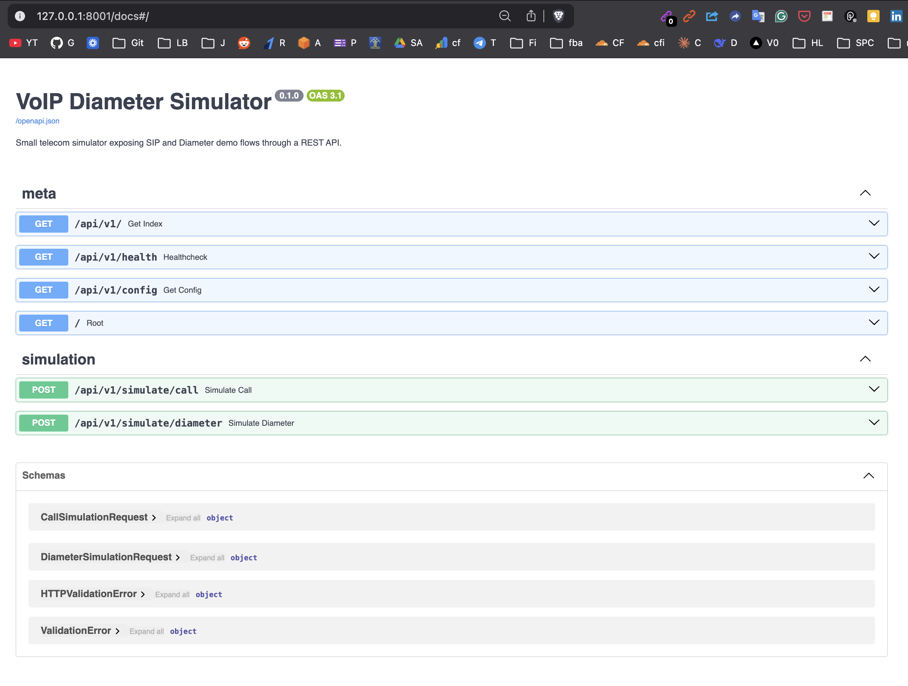

# VoIP Diameter Simulator

A lightweight telecom simulator demonstrating VoIP call flow and Diameter-based authentication using Python.

## Overview

This application models a small telecom environment where a SIP-based VoIP client initiates a call and a Diameter service validates subscriber access and session control. The goal is not full protocol compliance yet; it is a learning-oriented simulator that makes the core call and auth flow visible through simple API responses and structured logs.

## 🚀 VoIP Playground

The **VoIP + Diameter simulator playground** is now officially open.

You can explore the API, test call flows, and interact with the endpoints directly from the browser.

### 🌐 Try it in the Browser

Open the live Swagger interface and start playing with the APIs:

👉 **Swagger UI**

https://sachnaror.github.io/voip-diameter-simulator/

Test endpoints, simulate calls, and explore the telecom flow — safely.

---

### 🐳 Run it Locally with Docker

Prefer running things on your own machine? Pull the container and start the simulator locally.

👉 **Docker Hub**

https://hub.docker.com/r/schnarordocker/voip-diameter-simulator

Run it with:

```bash

docker pull schnarordocker/voip-diameter-simulator
docker run -p 8000:8000 schnarordocker/voip-diameter-simulator


## Features
```
- FastAPI server for simulator endpoints
- Sample SIP call-flow simulation endpoint
- Sample Diameter authentication/session endpoint
- Environment-based configuration using `.env`
- Project layout ready for VoIP, Diameter, session, and logging modules
```

## Project Structure

```
## 📂 Project Structure

```
voip-diameter-simulator/
├── app/
│   ├── core/                   # Shared configuration and session-management utilities
│   ├── diameter/               # Diameter authentication and message-processing components
│   └── voip/                   # SIP and call-flow simulation components
├── api/
│   ├── routes.py               # API endpoints for health, config, call simulation, and Diameter simulation
│   └── server.py               # FastAPI application initialization and configuration
├── logs/                       # Stores generated call and Diameter log files
├── tests/                      # Automated tests for API and simulator behavior

```

## Quick Start

```bash
cd voip-diameter-simulator
python -m venv .venv
source .venv/bin/activate
pip install -r requirements.txt
uvicorn api.server:app --reload --host 127.0.0.1 --port 8001
```

Open `http://127.0.0.1:8001/docs` to inspect the API.

## Current Status

The first pass implements the API bootstrap and core routes. VoIP call state, Diameter message parsing, logging persistence, and richer session orchestration will be expanded in the next steps.


------

Below is a combined, clean explanation that merges both explanations: the restaurant analogy + IMS telecom components + VoIP call flow.

This explanation helps visualize telecom VoIP architecture using everyday restaurant operations, making IMS components and protocols easier to understand.


1. Concept Overview

This system simulates how a VoIP call works inside a telecom network using IMS components. A VoIP client initiates a call using SIP, the network verifies the user through Diameter authentication against the subscriber database (HSS), and once approved the voice session starts using RTP.

Using the restaurant analogy:

A customer places an order with a waiter, the manager verifies the reservation in the restaurant system, and once approved the kitchen prepares the meal and serves it to the table.


2. Combined Mapping Table (Restaurant vs Telecom System)
## 🍽️ Restaurant vs Telecom System Mapping

| Restaurant Role | Telecom Component | Purpose |
|---|---|---|
| Customer | VoIP Client / Phone | Initiates call |
| Waiter | P-CSCF (Proxy Call Session Control Function) | Receives SIP request |
| Restaurant Manager | S-CSCF (Serving Call Session Control Function) | Controls call session |
| Reservation System | HSS (Home Subscriber Server) | Stores subscriber data |
| Manager verification process | Diameter protocol | Authentication & authorization |
| Kitchen | Call processing system | Executes call setup |
| Food delivery to table | RTP (Real-time Transport Protocol) | Transfers voice packets |
| Order ticket / order logs | SIP messages & call logs | Records communication events |


3. Step-by-Step Flow (Restaurant Analogy)
```
	1.	Customer sits at a table → Subscriber already exists in telecom database.
	2.	Customer places an order with the waiter → VoIP client sends SIP call request.
	3.	Waiter receives the order → P-CSCF receives the SIP request.
	4.	Waiter forwards order to manager → P-CSCF forwards request to S-CSCF.
	5.	Manager checks reservation system → S-CSCF queries HSS via Diameter.
	6.	Reservation system confirms customer details → HSS sends authentication response.
	7.	Manager approves the order → S-CSCF allows session establishment.
	8.	Order goes to kitchen → Call processing system prepares the call session.
	9.	Food is served to the customer → RTP begins sending voice packets.
	10.	Restaurant records order logs → System logs SIP messages and call details.
```


4. Combined Flow Diagram
```
Customer (VoIP Client)
        │
        │ 1. Places order / initiates call (SIP)
        ▼
Waiter (P-CSCF)
        │
        │ 2. Receives request
        ▼
Manager (S-CSCF)
        │
        │ 3. Verify customer
        ▼
Reservation Database (HSS)
        │
        │ 4. Authentication via Diameter
        ▼
Manager Approval
        │
        │ 5. Call session allowed
        ▼
Kitchen (Call Processing System)
        │
        │ 6. Meal prepared / call setup
        ▼
Food Delivered (RTP Voice Stream)
        │
        ▼
Customer receives meal / Voice call active
```


5. Final Simple Summary

```
Restaurant system flow:

Customer → Waiter → Manager verification → Reservation database → Kitchen → Food served

Telecom IMS system flow:

VoIP Client → P-CSCF → S-CSCF → HSS (via Diameter) → RTP → Voice Call Active
```
⸻

<p align="left">
  
</p>
